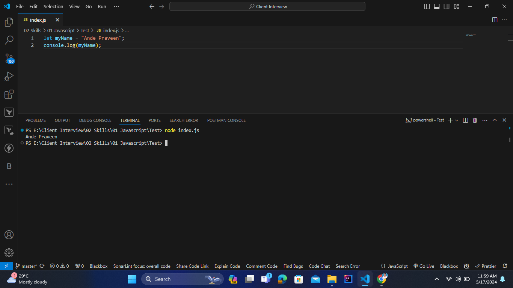

# NodeJS

<details>
<summary>Index</summary>

## Index
* Introduction 
* Module
* ES6 Export/Import

</details>

---

<details>
<summary>Introduction</summary>

## Introduction
- NodeJS is a Javascript runtime environment that executes Javascript code outside a web browser.
- With Node.js, JavaScript can run anywhere, including servers, desktops, and embedded systems.
- Node.js is a non-blocking I/O.



### Advantages
* Cross Platform (Windows, Linux, MacOS...etc)
* Open Source
* Huge number of third-party packages
* Huge Community

### JavaScript Engines
Every browser has its own JavaScript engine:
   1. Google Chrome → V8 Engine
   2. Firefox → SpiderMonkey

### What is Node.js?
- Node.js is built on Chrome’s V8 JavaScript engine.
- It is cross-platform, running on Windows, macOS, and Linux.
- Maintained by the OpenJS Foundation, which continuously adds new features.
- Executes JavaScript code outside the web browser.
- Allows JavaScript to run everywhere.
-  Node.js features an event-driven architecture that supports asynchronous (non-blocking) I/O operations.
Known for its high performance and scalability due to its non-blocking, event-driven nature.
- Node.js is popular because of its event-driven architecture.

### History of NodeJS
- Developed by Ryan Dahl in 2009.
- Originally named "web.js", as it was designed for web servers.
- Later renamed "Node.js", as it became useful beyond just web servers.
- JavaScript requires a JS engine to execute, and Node.js provides this capability outside browsers.
- To run a javascript you need a JS Engine
- You cannot run any Javascript code without JSEngine

### npm
- npm is a packages manager for JavaScript.
- It serves as a central registry where developers can publish and install packages.

</details>

---

<details>
<summary>Module</summary>

## Module
In Node JS, each Javascript file is treated as a separate module. 

### Export / Import
1. Default
2. Named

### Default
* The `module.exports` is a special object included in every Javascript file in the Node JS application by default.
* To import a module which is the local file, use the __require()__ function with the relative path of the module(fileName).

```js FirstModule.js
let FirstModule = () => {
    return "I am First Module"
};

// Default Export
module.exports = FirstModule;
```

```js
// Import
const FirstModule = require('./FirstModule');

console.log(FirstModule());  // I am First Module

```

### Named
You can export multiple items from a single file and import only what you need in another file.

```js Utils.js

// Functions
const FirstFunction = () => {
    return "I am First Function";
}

const SecondFunction = () => {
    return "I am Second Function";
}

// Named Export
exports.FirstFunction = FirstFunction;
exports.SecondFunction = SecondFunction;
```

```js
// Import 

const {FirstFunction, SecondFunction} = require('./Utils');


console.log(FirstFunction());  // I am First Function
console.log(SecondFunction());  // I am Second Function
```

</details>

---

<details>
<summary>ES6 Export/Import</summary>

## ES6 Export/Import
* Modern JS Module are known as ES6 Modules.
The `export` and `import` keywords are introduced for exporting and importing one or more members in a module.

1. Default 
2. Named

### Default 
Here we use file name extension as `.mjs`.

```js App.mjs
// Import
import FirstModule from "./FirstModule.mjs";

console.log(FirstModule());
```

```js FirstModule.mjs
// Export
let FirstModule = () => {
    return "I am First Module"
};

// Default Export
export default FirstModule

```

### Named 

```js Utils.mjs 

// Functions
export const FirstFunction = () => {
    return "I am First Function";
}

export const SecondFunction = () => {
    return "I am Second Function";
}

```

```js App.mjs
// Import 

import {FirstFunction, SecondFunction} from "./Utils.mjs"

console.log(FirstFunction());  // I am First Function
console.log(SecondFunction());  // I am Second Function
```


### Without mjs
* `npm init -y`
* Add type in the `package.json` file.
```json
{
  "type": "module"
}
```

```js Utils.js

// Functions
export const FirstFunction = () => {
    return "I am First Function";
}

const SecondFunction = () => {
    return "I am Second Function";
}

export default SecondFunction

```

```js App.js
// Import 

import SecondFunction, {FirstFunction} from "./Utils.js"

console.log(FirstFunction());  // I am First Function
console.log(SecondFunction());  // I am Second Function
```

</details>

---
